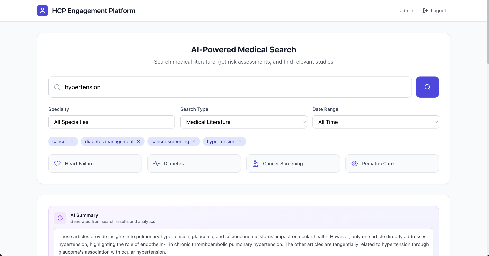
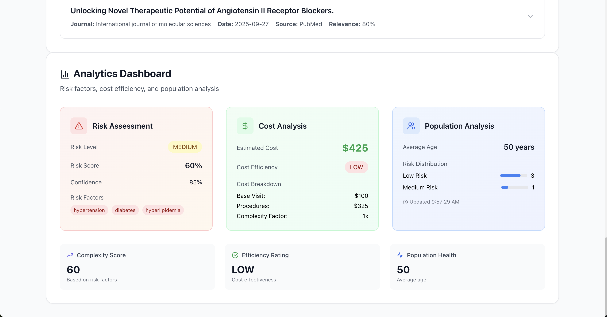

# HCP Engagement API

A comprehensive healthcare professional engagement platform with AI-powered medical literature search, risk assessment, and analytics capabilities.




## Features

### AI-Powered Medical Search
- **Real-time Literature Search**: Search PubMed database for medical research articles
- **AI-Generated Summaries**: Get intelligent summaries of search results using Groq AI
- **Smart Suggestions**: AI-powered autocomplete for medical terms and conditions
- **Collapsible Article View**: Expandable article entries with full abstracts

### Analytics Dashboard
- **Risk Assessment**: AI-powered patient risk analysis with confidence scores
- **Cost Analysis**: Treatment cost estimation and efficiency ratings
- **Population Trends**: Demographic analysis and risk distribution
- **Interactive Charts**: Visual representation of analytics data

### Authentication & Security
- **JWT-based Authentication**: Secure token-based user authentication
- **Role-based Access**: Support for different user roles and specialties
- **CORS Protection**: Secure cross-origin resource sharing

## Tech Stack

### Backend
- **Flask**: Python web framework
- **Flask-SocketIO**: Real-time communication
- **Flask-JWT-Extended**: JWT authentication
- **Groq AI**: AI-powered analysis and summaries
- **PubMed API**: Medical literature search via `pymed`
- **Flask-CORS**: Cross-origin resource sharing

### Frontend
- **Next.js**: React framework
- **TypeScript**: Type-safe JavaScript
- **Tailwind CSS**: Utility-first CSS framework
- **Lucide React**: Beautiful icons
- **API Proxy**: Next.js API routes for backend communication

## Prerequisites

- Python 3.12+
- Node.js 18+
- npm or yarn
- Groq API key

## Quick Start

### 1. Clone the Repository
```bash
git clone <repository-url>
cd demo-hcp-engagement-api
```

### 2. Backend Setup
```bash
cd hcp-engagement-api-dev

# Create virtual environment
python3 -m venv venv
source venv/bin/activate  # On Windows: venv\Scripts\activate

# Install dependencies
pip install -r requirements.txt

# Set up environment variables
echo "GROQ_API_KEY=your_groq_api_key_here" > .env
echo "FLASK_DEBUG=True" >> .env

# Start the backend server
python3 app.py
```

### 3. Frontend Setup
```bash
cd hcp-frontend

# Install dependencies
npm install

# Start the development server
npm run dev
```

### 4. Access the Application
- **Frontend**: http://localhost:3000
- **Backend API**: http://localhost:5000
- **Health Check**: http://localhost:5000/health

## Environment Variables

### Backend (.env)
```env
GROQ_API_KEY=your_groq_api_key_here
FLASK_DEBUG=True
```

### Getting a Groq API Key
1. Visit [Groq Console](https://console.groq.com/)
2. Sign up/Login to your account
3. Navigate to API Keys section
4. Create a new API key
5. Copy the key (starts with `gsk_`)

## API Endpoints

### Authentication
- `POST /auth/login` - User login
- `POST /auth/logout` - User logout

### Literature Search
- `POST /literature/search` - Search medical literature with AI analysis
- `GET /literature/health` - Literature service health check

### Analytics
- `POST /analytics/predict-risk` - Risk assessment analysis
- `POST /analytics/predict-cost` - Cost analysis
- `POST /analytics/population-trends` - Population analysis

### AI Services
- `POST /ai/analyze` - General AI analysis
- `POST /ai/suggestions` - AI-powered search suggestions

## Usage

### 1. Login
- Default credentials: `demo_admin` / `admin123`
- Or create new user accounts

### 2. Search Medical Literature
- Enter medical terms, conditions, or treatments
- Get AI-powered suggestions as you type
- View collapsible article results with full abstracts

### 3. View Analytics
- Risk assessment with confidence scores
- Cost analysis and efficiency ratings
- Population trends and demographics

### 4. AI Summaries
- Automatic AI-generated summaries of search results
- Combines literature findings with analytics data
- Powered by Groq's Llama models

## Development

### Backend Development
```bash
cd hcp-engagement-api-dev
source venv/bin/activate
python3 app.py
```

### Frontend Development
```bash
cd hcp-frontend
npm run dev
```

### Testing
```bash
# Test environment variables
python3 test_env.py

# Test API endpoints
python3 test_api.py
```

## Troubleshooting

### Common Issues

#### Port Conflicts
```bash
# Kill processes on ports 5000 and 5001
lsof -ti:5000,5001 | xargs kill -9
```

#### CORS Issues
- The frontend uses Next.js API proxy routes to avoid CORS
- All API calls go through `/api/proxy/*` endpoints

#### Authentication Errors
- Clear browser localStorage: `localStorage.clear()`
- Re-login to get fresh JWT tokens

#### API Key Issues
- Verify your Groq API key is valid
- Check the `.env` file in the backend directory
- Restart the backend server after updating the key

### Debug Mode
- Backend logs are available in the terminal
- Frontend console shows detailed API request/response logs
- Check browser Network tab for failed requests

## Project Structure

```
demo-hcp-engagement-api/
├── hcp-engagement-api-dev/          # Backend Flask API
│   ├── app.py                       # Main Flask application
│   ├── requirements.txt             # Python dependencies
│   ├── .env                         # Environment variables
│   └── test_*.py                    # Test scripts
├── hcp-frontend/                    # Frontend Next.js app
│   ├── src/app/                     # Next.js app directory
│   │   ├── login/                   # Login page
│   │   ├── dashboard/               # Main dashboard
│   │   └── api/proxy/               # API proxy routes
│   ├── package.json                 # Node.js dependencies
│   └── next.config.js               # Next.js configuration
└── README.md                        # This file
```

## Contributing

1. Fork the repository
2. Create a feature branch
3. Make your changes
4. Test thoroughly
5. Submit a pull request

## License

This project is licensed under the MIT License - see the LICENSE file for details.

## Support

For issues and questions:
1. Check the troubleshooting section above
2. Review the console logs for error messages
3. Ensure all dependencies are installed correctly
4. Verify API keys are valid and properly configured

## Updates

### Recent Changes
- Added AI-powered search suggestions
- Implemented collapsible article dropdowns
- Added real PubMed integration
- Enhanced AI summary generation
- Improved error handling and debugging
- Fixed CORS issues with Next.js proxy

### Planned Features
- User management system
- Advanced filtering options
- Export functionality
- Real-time notifications
- Mobile responsiveness improvements
